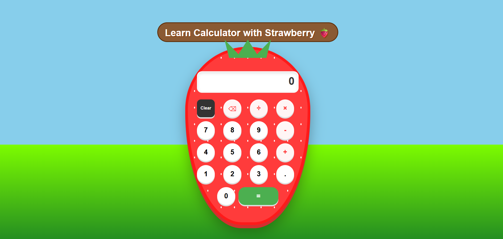
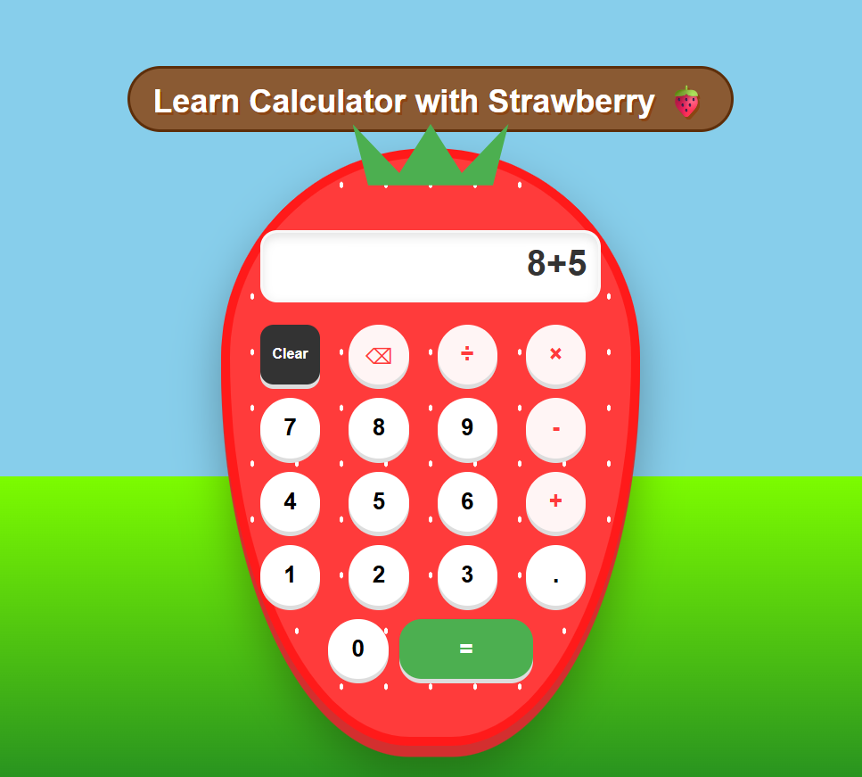
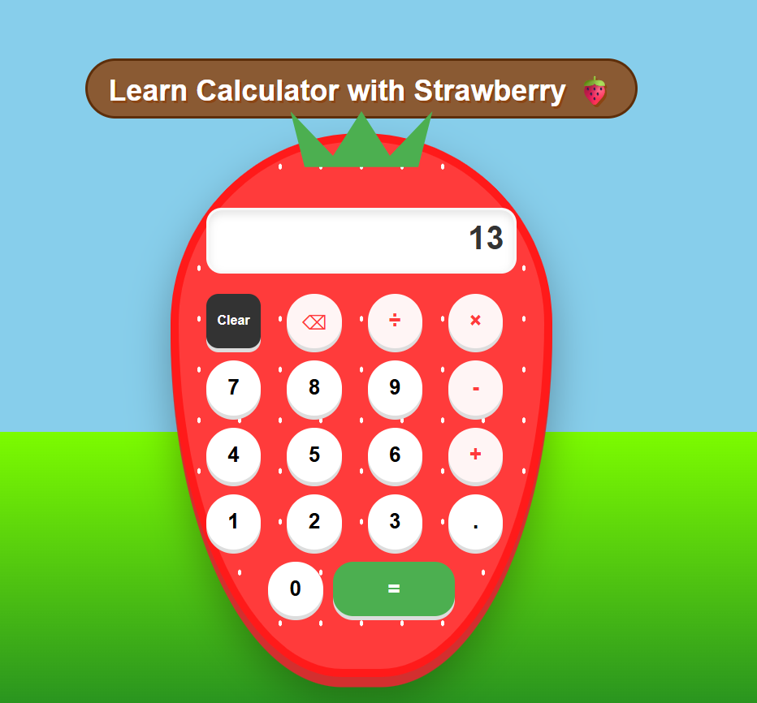

# 🍓 Learn Calculator with Strawberry

A fun, educational calculator for kids set in a colorful, vibrant farm environment. This web-based tool is designed specifically for young learners, combining a playful fruit-themed interface with reliable mathematical logic.

---

## 📸 Screenshots

### 1. The Welcome Screen
The calculator starts with a clean interface and a friendly farm background.

### 2. Doing Math
The display area shows the operation (like 8+5) so kids can see exactly what they are typing.

### 3. Get the Result
Clear, bold results help children verify their math problems easily.

---

## 🌟 Key Features
* **Kid-Friendly Design**: Shaped like a large strawberry with bright colors, a green leaf crown, and realistic white seed textures.
* **Visual Operations**: A clear display area (history track) that shows the current math operation before the final answer.
* **Compact & Perfect Fit**: Re-engineered layout (specifically the "0" and "=" buttons) to stay perfectly inside the strawberry shape on any desktop.
* **Responsive Farm Theme**: A beautiful background featuring sky and grass gradients that makes learning feel like a game.
* **Smart Decimals**: Rounds long numbers to two decimal places to keep math simple for beginners.

---

## 🛠️ Built With
* **HTML5**: Structure and semantics.
* **CSS3**: Custom fruit shapes, radial gradients for seeds, and responsive scaling.
* **JavaScript**: Real-time calculation logic and button interactions.

---

## 🚀 How to Use
1.  **Download**: Clone or download this repository to your computer.
2.  **Open**: Locate the `index.html` file in your folder.
3.  **Launch**: Right-click `index.html` and select **Open with** (Chrome, Safari, or Edge).
4.  **Calculate**: Start having fun with math!

---

## 📝 License
This project is open-source and free to use for educational purposes.
